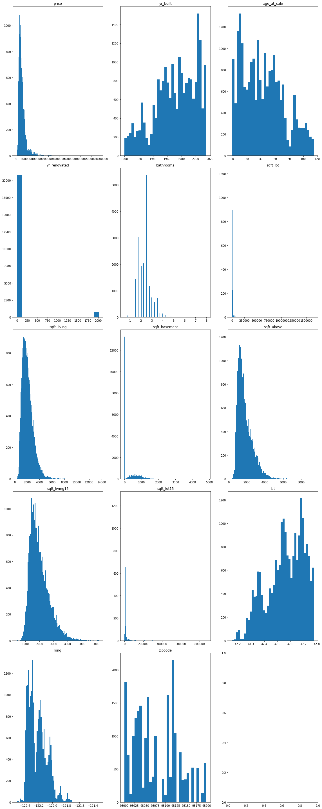

## Is normalization needed?
We checked to see if we can feature scale some of the features. As an experiment on the data, I went ahead and tried log normalization on the data. 

### First I had to check to see if there were any graphs upon visual inspection of the data where the data starts skewing.

I saw there were some graphs that looked exponential.

I normalized with log, then re-ran another summary. My R^2 jumped from 0.393 to 0.492 and my QQ-Plot looked so pretty with barely any deviation from the line.

Sounds good right? No.

I've concluded that normalization, while it makes things look prettier, can mislead the significance of some of the features and cause biases in the model.  For future work, we can check to see other methods which can show significance between features other than normalization which might obfuscate the results.  

## So, do we need to normalize?

Upon inspection of the two OLS summaries, one with normalization and one without, I observed the following:¶
1) While a log normalization did increase the R^2 value from 0.393 to 0.492, this is still not good.
2) Conclusion: Normalization, while making things look pretty, have to taken with a grain of salt. Additionally, even with normalization, the model won't fit well with a poor R^2 even with a nice linear looking qq_plot.
3) Additional caveat and potential future work analysis:
If we have a low R^2 value, we can still see if there are significant interactions with other methods, not only R^2
4) Also for future work would be to remove the higher end price data altogether for another regression to see if R^2 and residuals can play along better

